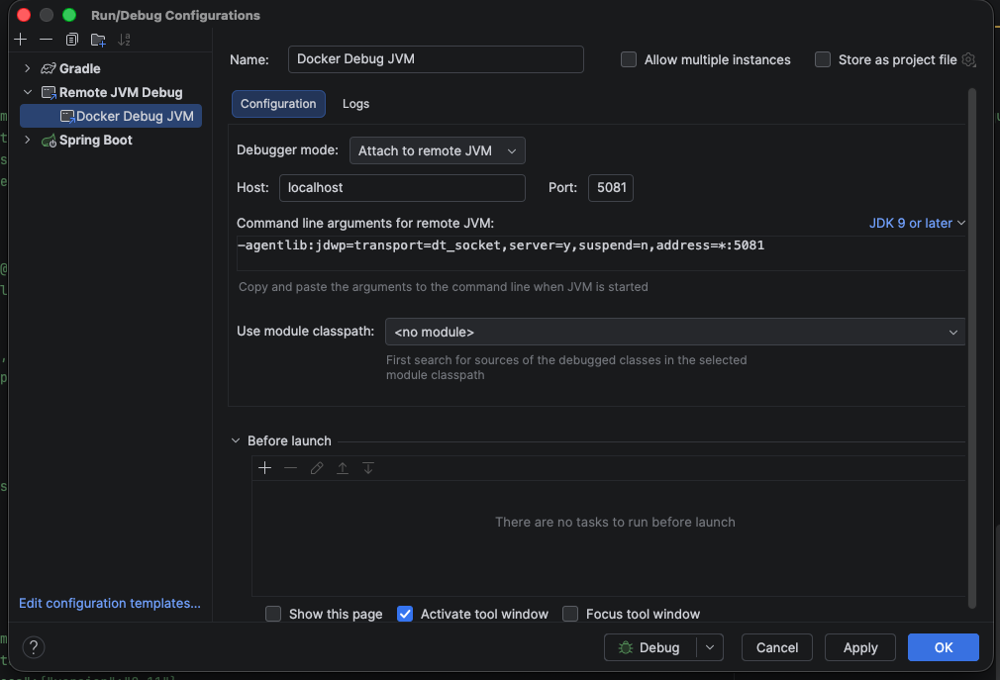

## Data claims event service

[](https://github.com/ministryofjustice/laa-data-claims-event-service/actions/workflows/build-main.yml)

## Prerequisites

- **Docker** - For running LocalStack and Wiremock containers

## Project Structure

Includes the following subprojects:

- `data-claims-event-service` - Data claims event service which processes claims from an SQS queue.
- `reference-provider-details-api` - OpenAPI specification for the Provider Details API used for
  generating model classes.

## Technology Stack

### Key Components

- **[laa-spring-boot-common](https://github.com/ministryofjustice/laa-spring-boot-common)** - Shared infrastructure and standards used across LAA projects
- **[Spring Boot 4.0.2](https://spring.io/projects/spring-boot)** - Application framework
- **[Spring Framework 7.0.2](https://spring.io/projects/spring-framework)** - Core framework
- **[Spring Cloud AWS 4.0.0](https://awspring.io/spring-cloud-aws/)** - AWS integration (SQS, LocalStack)
- **[Java 21+](https://www.oracle.com/java/technologies/downloads/)** - Minimum JDK version
- **[Gradle 9.x](https://gradle.org/)** - Build tool
- **[TestContainers 1.20.1](https://testcontainers.com/)** - Integration testing with Docker containers
- **[Sentry 8.31.0](https://docs.sentry.io/platforms/java/guides/spring-boot/)** - Error tracking and performance monitoring

## Development

For detailed information code quality and formatting when contributing to this project, see [DEVELOPMENT.md](DEVELOPMENT.md).

## Usage

### First time setup

The project uses the `laa-spring-boot-gradle-plugin`. Please follow the steps in
the [laa-spring-boot-common](https://github.com/ministryofjustice/laa-spring-boot-common?tab=readme-ov-file#provide-your-repository-credentials)
repository to set up your Github Packages credentials locally before building the application.

### Build application

`./gradlew clean build`

Includes checkstyle, spotless checks and unit tests.

### Run integration tests

`./gradlew integrationTest`

### Localstack & Wiremock

This project has dependencies on SQS, and various RESTful APIs. To run this project locally, an
instance of Localstack and three instances of Wiremock must be running. This can be achieved via
docker:

```shell
docker-compose up -d
```

To run the project using whilst depending on Wiremock, the `Wiremock` spring profile should be 
enabled.

#### SQS helper scripts
To aid with pushing test messages to the SQS queue, the following scripts are provided:
- `docker-scripts/view-messages-in-queue.sh`
- `docker-scripts/clear-queue.sh`
- `docker-scripts/publish-bulk-submission-event.sh`
- `docker-scripts/publish-submission-validation-event.sh`

### Set environment variables
The following environment variables are required to connect to Localstack SQS:
```sh
export AWS_ACCESS_KEY_ID=test
export AWS_SECRET_ACCESS_KEY=test
export AWS_ENDPOINT_URL=http://localhost:4566
export AWS_REGION=us-east-1
export BULK_CLAIM_QUEUE_NAME=claims-api-queue
```


## Logging Configuration

This application uses ECS (Elastic Common Schema) structured logging for production environments and console logging for local development.
For local development logging use: ```./gradlew bootRun --args='--spring.profiles.active=wiremock'```
and add the following to your application-local.yaml

###  Structured Logging (Default/Production)
By default, the application outputs logs in ECS JSON format with distributed tracing support:
```
{
    "@timestamp":"2026-04-10T16:00:49.135055091Z",
    "log":
        {
            "level":"INFO",
            "logger":"uk.gov.laa.springboot.auth.ApiAuthenticationFilter"
        },
    "process":
        {
            "pid":1,
            "thread":{"name":"http-nio-8080-exec-10"}
        },
    "service":
        {
            "name":"LAA Data Stewardship Payments - Claims Data Application",
            "version":"1.0.33-SNAPSHOT",
            "environment":"default",
            "node":{"name":"02e3a9903fa1"}
        },
    "message":"Endpoint 'GET /api/v1/submissions/019d781f-b75e-7ce5-a91f-a5f5a8970f14/claims/019d781f-ba19-7d68-82c0-66c1d69e357c' requested by test-runner.",
    "traceId":"69d91eb1dfc02bcf7eacafafe2b18563",
    "spanId":"d9a679919ac18e0e",
    "ecs":{"version":"8.11"}
    }
    
{
    "@timestamp":"2026-04-10T16:18:15.084580589Z",
    "log":{
        "level":"INFO",
        "logger":"uk.gov.justice.laa.dstew.payments.claimsevent.DataClaimsEventServiceApplication"
    },
    "process":
        {
            "pid":1,
            "thread":{"name":"main"}
        },
    "service":
        {
            "name":"laa-data-claims-event-service",
            "version":"0.0.155-SNAPSHOT",
            "environment":"default",
            "node":{"name":"18950db45db5"}
        },
    "message":"Started DataClaimsEventServiceApplication in 4.656 seconds (process running for 5.421)",
    "tags":["COMMONS-LOGGING"],
    "ecs":{"version":"8.11"}
}
````

### Run application

`./gradlew bootRun`

`./gradlew bootRun --args='--spring.profiles.active=wiremock'`

### Attach debugger to remote JVM
When running the application in docker, you can attach a debugger to the remote JVM by creating
a new run configuration in IntelliJ IDEA. The port the JVM is exposed on is 5081.


